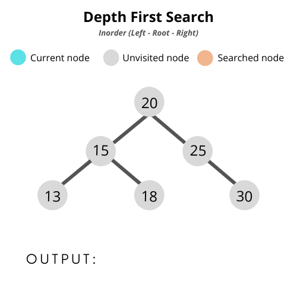
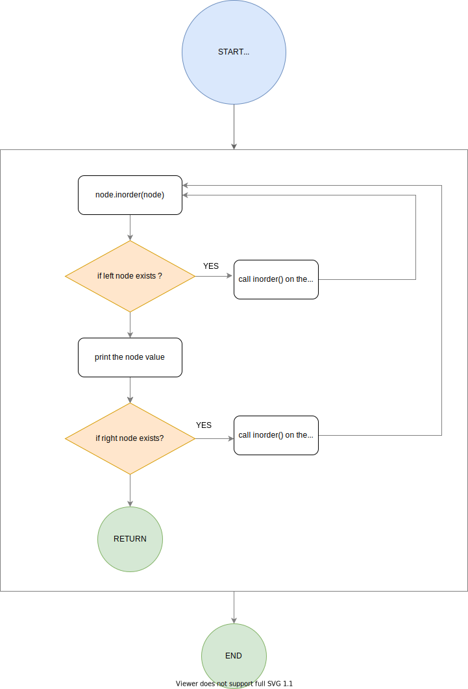
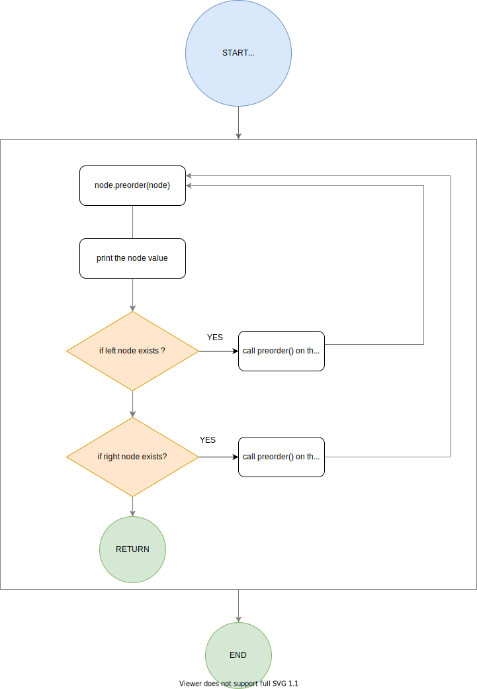
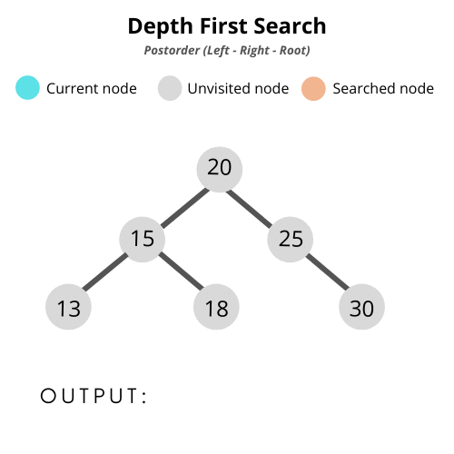

Welcome to the 2nd part of my programming tutorial series on Binary Trees! In this article, you'll learn the concepts behind Tree traversal. You'll understand some popular tree-traversal techniques and how do they work, and you'll also learn to implement them using JavaScript.

# Pre-requisites
- A basic understanding of what is a binary tree. If you're new to this concept or would like a refresher, do read the first part of this series <a href="/implement-binarySearchTree/" target="_blank" rel="noreferrer">here</a>, and visit this article later!
- Some basic understanding of JavaScript


 ## Over the next 20 minutes, here's what you're gonna learn:

- Commonly used tree-traversal techniques - Breadth-first Search (BFS) and Depth-first Search (DFS)
- Deep dive into Depth-first search algorithms:
  - Inorder traversal
  - Preorder traversal
  - Postorder traversal

You'll learn about Breadth-first Search in the next tutorial.

Ready? Let's go!

  

# So what is a tree traversal anyway?

**Here's what <a href="https://en.wikipedia.org/wiki/Tree_traversal" target="_blank" rel="noreferrer">Wikipedia </a>says**
> In Computer Science, tree traversal (also known as tree search and walking the tree) is a form of graph traversal and refers to the process of _visiting (checking and/or updating) each node_ in a tree data structure, **exactly once**. Such traversals are classified by the **order** in which the nodes are visited.

Tree traversal algorithms can be broadly classified into two types:

- **Breadth-first Search**

This technique works by first visiting all nodes in a level once, before proceeding to the next levels. The reason it is called "breadth-first", is because this search **widens** or goes broad in its search strategy.

- **Depth-first Search**

A depth-first search, on the other hand, works by going "deeper" into one part of the graph and visiting all of its nodes all the way to the end. Once it has no further nodes to visit for that sub-tree, it **backtracks** to the latest point where it could make a different choice, then explores out from there.

For a binary-tree, this method is usually done in a left to right order. That is, the search evaluates the left-most branch/sub-tree of the tree, and then it proceeds to the one to the right of it, and so on until all the branches are visited.

----

<span style="font-size:30px;">T</span>rees are a special case of a **Graph** data structure. That's why algorithms like Depth First Search (DFS) and Breadth First Search (BFS) can be applied to them as well. The **Important** note to remember is that while graph-traversals can typically start from __any node/vertex__, a tree-traversal will always start from the __root node__.


## Applications of Depth-first search tree traversal
Before  you even begin to deep dive into the implementation details, I feel that it's always helpful to begin with the question *Why?* Why do we even need to know these algorithms in the first place, and what are their applications? 

I was very curious to find out as I had only heard of DFS before, and had an idea of how they work, but never really understood where or why they even exist. As it turns out, the number of applications are incredibly huge! 

Here are just a few applications where DFS is often used as a building block:

- **Find Solutions for Puzzles:**

In strategy based games like chess, sudoku, alpha-go, board configurations are often represented in the form of a 
<a href="https://en.wikipedia.org/wiki/Game_tree" target="_blank" rel="noreferrer">game tree</a>. In this scenario, variations of DFS are often used for finding the shortest or the most optimum set of moves.
	
- **Find Connected Components:**

  You can use DFS to find connected components in an **Undirected Graph**. I couldn't find good examples of real world applications of undirected graphs, so if you do have any specific example for this, I would love to know :)

-  **Find Strongly Connected Components:**
    - DFS has applications in a **social graph** as well. One example could be when you want to suggest or advertise certain content specific to people who have liked similar pages or liked similar videos. This could be represented as a strongly connected graph, that uses DFS to search for entities that are similar to each other.
	- One other interesting application is the <a href="https://developers.google.com/optimization/routing/vrp" target="_blank" rel="noreferrer">Vehicle Routing Problem </a> which helps in finding the optimal (Minimize total cost routes) for multiple vehicles visiting a set of locations.
	
- **Finding a Path:**
	
  It can be used to see if a path exists from vertex `u` to vertex `v`.
	
- **Topological Sorting Algorithm:**

	**Directed Acyclic Graphs (DAG)** can be used to maintain **linear ordering** of tasks. For instance, the vertices of the graph may represent tasks to be performed, and the edges may represent constraints that one task must be performed before another. Here are a couple of examples:

  - In an ATM transaction, tasks happen in a certain sequence. First, we need to insert ATM, enter PIN and authenticate yourself, and only later withdraw the amount. You can't withdraw money before you even insert/scan a card. This order of operations can be represented using a DAG, where you could use topological sorting.
  - Turn-based games like chess that use game trees are also another example, where certain moves become available only when the player reaches a certain board config.
	- If you're using  Debian-based UNIX system then there's no escape from using `apt-get` command, which makes use of  topological sorting to determine the best possible way to install or remove packages.

> **Note**: It's important to understand that the search algorithm used in the above applications isn't strictly speaking or exactly DFS. It's more accurate to say that these algorithms are a variant of DFS, optimized further to perform better in some tasks than others.
> 
> Some of them are even used in conjunction with traditional BFS (breadth-first search) algorithms as well, such as <a href="https://en.wikipedia.org/wiki/Iterative_deepening_depth-first_search" target="_blank" rel="noreferrer">Iterative Deepening Depth First Search </a>. But more on that later.

Now that we've looked at some of the applications, let's look at some common traversal patterns used in DFS: 

---
  
# Common traversal patterns used for DFS:

<span style="font-size:30px;">A</span>s stated earlier, a binary tree can be traversed in a left to right order, and also right to left. But most commonly used traversing techniques that we'll discuss will proceed in a left to right fashion. These traversals can either use recursive techniques, or they can be done iteratively as well (for which you'll need to use a stack, a special kind of data-structure).

For this tutorial, you'll learn to implement these traversals using **recursion**.

## Inorder traversal (Left - Root - Right)
An inorder traversal works in the following manner:

1. We'll start from the root node and traverse the entire left subtree recursively.
2. Access the data value of the root node and do whatever you need to do with it. For the purposes of this tutorial,
we'll just be printing the value.
3. Then traverse the entire right subtree recursively.

### Here's a gif and a flowchart to help you visualize it:



> **Note:** This traversal always prints the node values in a **sorted** order. 
That's because the values in the left subtree are **smaller** than the root node and 
values in the right subtree are **greater** than the root node.



<span style="font-size:30px;">Y</span>ou'll continue from the <a href="/implement-binarySearchTree/" target="_blank" rel="noreferrer">last tutorial</a> where you coded a BST in JavaScript, and extend the program to implement DFS. If you need a refresher, do read it once again.

### Here's how a JS implementation of an inorder traversal looks like:

```
function inOrder(root) { 
  root.left && inOrder(root.left)
  console.log(root.val)
  root.right && inOrder(root.right)
}

<!-- Call the inorder function. Remember, we're referring above gif's BST for reference-->
node.inOrder(node) // 13, 15, 18, 20, 25, 30
```

<br>

To be able to understand it clearly, you must know how _recursion_ works.
I'll do my best to elaborate on it. 

1. We'll start with the root Node. <a href="./Inorder-traversal.gif" target="_blank" rel="noreferrer">In our gif</a>, our root node contains the value `20`.
2. Next, check whether this node has a left child. If yes, then we'll start our search in the left
  subtree. This will call the `inorder() ` method again, on the node that contains the value `15`.
3. Again, it checks if it has a left child. Yes, indeed we have node with value `13` on the left. 
4. It calls `inorder()` on node `13`. But it doesn't have a child node on the left. So the control goes to the next line, and it prints `13` at this point. Finally, we check for the right subtree of the node `13`, which doesn't exist either! So there is nothing more to do, and the program returns to the parent `inorder` function that called it, on the node with value `15`.
5. This way, the entire left subtree of the node `15` has been traversed when we called `inOrder(root.left)`.
Next, `15` gets printed, and then the program proceeds to evaluate the right subtree for the node.
6. And the same process repeats all over again until the entire tree has been covered!

---
Hopefully, you were able to follow all of that! If you didn't, go watch this<a href="https://www.youtube.com/watch?v=kepBmgvWNDw" target="_blank" rel="noreferrer"> video on recursion.</a> 

Moving on to the next traversal pattern:

## Preorder (Root - Left - Right)

Here's how it works, starting from the root node just like inorder:
1. First, access the current node value, to say, print it out.
2. Then, we do the preorder traversal on the left subtree.
3. And finally, do the same with the right subtree.

Basically, we print the parent node first and then the left node and lastly right node. 
Rinse and repeat, until we've covered the whole tree.

### Here's a visual followed by a flow diagram:




### So the JavaScript implementation would look something like this:
``` 
  preOrder(node) {
    console.log(node.val)
    node.left && this.preOrder(node.left)
    node.right && this.preOrder(node.right)
  }

  <!-- Call the preorder function. We're referring above gif for reference -->
  node.preOrder(node) // 20, 15, 13, 18, 25, 30
```

## Postorder(Left - Right - Root)

This traversal works this way:

1. First, traverse the left subtree recursively.
2. Then traverse the right subtree recursively.
3. Then finally, access the current node value and print it.

### Here's how it looks like:




### And here's the program:

```
  postOrder(node) {
    node.left && this.postOrder(node.left)
    node.right && this.postOrder(node.right)
    console.log(node.val);
  }

 <!-- Call the postorder function. We're referring above gif for reference -->
  node.postOrder(node) // 13, 18, 15, 30, 25, 20
```

----
<br>

> **Note:** As you might have noticed, these traversal patterns don't vastly differ from one another in their actual code. However, there will be situations where it might be preferable to use one kind of traversal over others.

### Some uses of DFS tree traversal patterns:

#### Serialization and De-serialization

Here's the Wikipedia <a href="https://en.wikipedia.org/wiki/Serialization" target="_blank" rel="noreferrer">definition.</a>:

> In computing, serialization is the process of translating data structures or object
state into a format that can be **stored** (for example, in a file or memory buffer) or **transmitted** 
(for example, across a network connection link) and **reconstructed** later (possibly in a different 
computer environment).
> <br>
> <br>
> When the resulting series of bits is reread according to the serialization format, 
it can be used to create a semantically **identical clone** of the original object.

In the context of Binary trees, you can think of serialization as converting the tree structure into a **string** or an **array** format. So for example, a postorder traversal gave us this output: `13, 18, 15, 30, 25, 20`. This can be stored as a string or in an array (serialization), and it can be used later to construct 
a new identical BST (de-serialization).

You can create a BST using these combinations:

- Both preorder and postorder traversals can be used to create (de-serialize) an original BST.
- You can also use postorder and inorder in conjunction to create a BST.
- You can use preorder and inorder together to create a BST.
- You can just use postorder alone to create a BST.

## Here are some more further applications:

### Pre-order traversal:

It can be used to make a prefix expression (**Polish Notation**) from expression trees. If you don't know,
I would suggest reading this artcle on <a href="https://en.wikipedia.org/wiki/Polish_notation" target="_blank" rel="noreferrer">Wikipedia.</a>

__For example:-__

This infix expression **`A - (B + C) + (D + E)`** can be converted to prefix expression as **`"+  *  A  -  B  C  + D  E"`**. This conversion makes it extremely easy for compilers to evaluate arithmatic/algebric equations with prefix/postfix expressions than inorder expression. 

Humans are really good at scanning things and remembering the conventional associativity and precedence rules and then we evaluate the equation. We just have to eyeball it. But for a compiler, it will be more complex as it has to take into account the associativity and precedence rules when evaluating the equation. This could be an unnecessary overhead.

So it's recommended to convert your inorder expression to either postfix or prefix before the compiler parses
the expression, since then it wouldn't need to know the precedence of operators for these two expressions.

Prefix expressions are evaluated from __right to left__, and they use a stack data structure.


### Post-order traversal:

Just like how preorder traversal is used to generate a prefix expression from a tree, we use postOrder
traversal to generate a postfix expression <a href="https://en.wikipedia.org/wikiReverse_Polish_notation" target="_blank" rel="noreferrer">**Reverse Polish Notation**</a>. For example, this infix expression 
**`A - (B + C) + (D + E)`** can be converted to a postfix expression **`"A B C - * D E + +"`** using stack data structure.

A Post-order traversal is also used when you want to explore **leaf nodes first**. For example - when you need to **delete** a node, it'll be necessary to access and delete its children nodes first to free up memory, before you delete the node itself!

Postfix expressions are read from __left to right__, and they also use the stack data structure while evaluating.

  
### Inorder traversal:

This is one of the most commonly used traversal techniques for binary search trees because it returns the 
values in the __same order__ which was used to create the tree in the first place. So if you need to access the values in sorted order, you will use inorder traversal.


---

## Thank you for reading.

Graph-based data structures and algorithms are numerous and we've just scratched the surface here! In the next tutorial, we'll cover Breadth-first Search. 

If you have any feedback do let me know in the comments on my medium blog or reach out to me on <a href="https://twitter.com/pooyax14" target="_blank" rel="noreferrer">Twitter</a>.

If you liked the tutorial, do give it a thumbs up 🙂. See you soon!

__If you want to do further reading, go check out these tutorials.__

- #### Depth First Search
  - <a href="https://brilliant.org/wiki/depth-first-search-dfs/" target="_blank" rel="noreferrer">Brialliant</a>
  - <a href="https://www.hackerearth.com/practice/algorithms/graphs/depth-first-search/tutorial/" target="_blank" rel="noreferrer">Hackerearth</a>
  - <a href="https://en.wikipedia.org/wiki/Depth-first_search" target="_blank" rel="noreferrer">Wikipedia</a>

- #### Tree Traversal
  - <a href="https://en.wikibooks.org/wiki/A-level_Computing/AQA/Paper_1/Fundamentals_of_algorithms/Tree_traversal" target="_blank" rel="noreferrer">Wikibooks</a>
  - <a href="https://opendsa-server.cs.vt.edu/ODSA/Books/CS3/html/BinaryTreeTraversal.html" target="_blank" rel="noreferrer">ODSA book on Binary Tree traversal</a>

- #### Books on Alogrithms
  - <a href="https://www.oreilly.com/library/view/algorithms-in-a/9780596516246/ch07s02.html" target="_blank" rel="noreferrer">Oreilly</a>
  - <a href="https://www.coursera.org/learn/algorithms-part2#syllabus" target="_blank" rel="noreferrer">Coursera</a>

- #### Applications of dfs
  - <a href="https://www.geeksforgeeks.org/applications-of-depth-first-search/?ref=lbp" target="_blank" rel="noreferrer">Applications of Depth First Search on geeksforgeeks</a>
